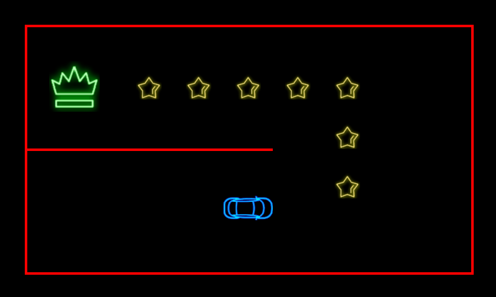

# 汽车迷宫

使用DQN算法来训练小车，使其能够完成迷宫任务。




**环境依赖:**

```Python 3.8.19```

所需要的python库可见```requirements.txt``` 

你可以使用```pip install -r requirements.txt```来安装所需要的python包.

**如何使用:**

只需要运行```dqn_train.py```就可以开始训练，运行```dqn_test.py```即可以评测训练得到的模型。


**该智能体使用DQN算法进行训练，使用Pygame进行可视化。环境所用动作空间为离散动作空间，详情可见```discrete_env.py```，```level1.txt```记录了相关的地图信息。**

# Car Maze

Train a car using the DQN (Deep Q-Network) algorithm to navigate and complete a maze task.

**Environment Dependencies**:

```Python 3.8.19```

The required Python libraries can be found in the ```requirements.txt``` file.

You can install the necessary Python packages by running ```pip install -r requirements.txt```.

**How to Use**:

Simply run ```dqn_train.py``` to start training the agent, and run ```dqn_test.py``` to evaluate the trained model.

**The Agent**:

The agent is trained using the Deep Q-Network (DQN) algorithm, with visualizations handled by Pygame. The environment employs a discrete action space, which can be found in detail in ```discrete_env.py```. The ```level1.txt``` file records the relevant map information for the maze.
